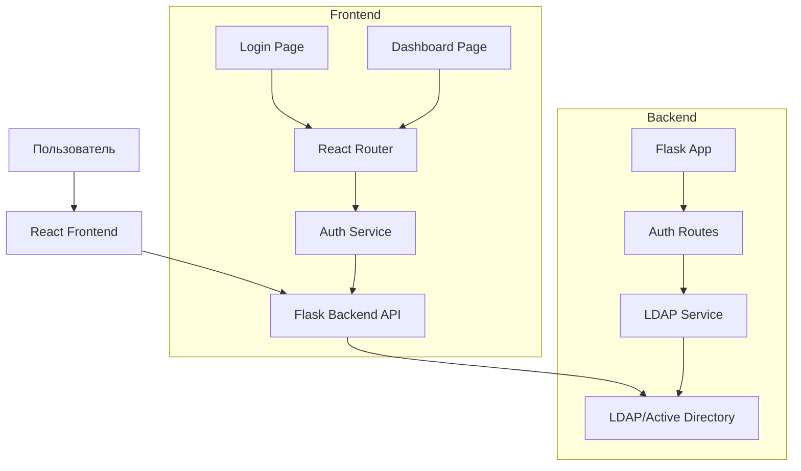

# Архитектура Frontend для LDAP Authentication Project

## Общая архитектура системы



## Структура директорий

```
src/
├── ldap_auth/          # Существующий backend
│   ├── app.py
│   ├── auth.py
│   ├── config.py
│   └── routes.py
└── frontend/           # Новый frontend (React + Vite)
    ├── public/
    │   └── index.html
    ├── src/
    │   ├── components/
    │   │   ├── LoginPage.jsx
    │   │   └── DashboardPage.jsx
    │   ├── services/
    │   │   └── authService.js
    │   ├── App.jsx
    │   ├── main.jsx
    │   └── index.css
    ├── vite.config.js
    └── package.json
```

## Компоненты Frontend

### 1. LoginPage Component
- Форма входа с полями username и password
- Валидация полей
- Отправка данных на backend API
- Обработка ошибок аутентификации

### 2. DashboardPage Component
- Тестовая страница после успешного входа
- Кнопка выхода

### 3. AuthService
- Функции для аутентификации
- Управление токенами/сессией
- Перенаправление при успешной аутентификации

## Интеграция с Backend

Backend API endpoint для аутентификации:
```
POST /auth
Content-Type: application/json

{
  "username": "string",
  "password": "string"
}
```

Ответы:
- 200: Успешная аутентификация
- 400: Отсутствуют данные
- 401: Неверные учетные данные
- 500: Ошибка сервера

## Технологии

- **Frontend Framework**: React 18+
- **Build Tool**: Vite
- **Routing**: React Router v6+
- **Styling**: CSS Modules или Tailwind CSS (по выбору)
- **HTTP Client**: Axios или fetch API